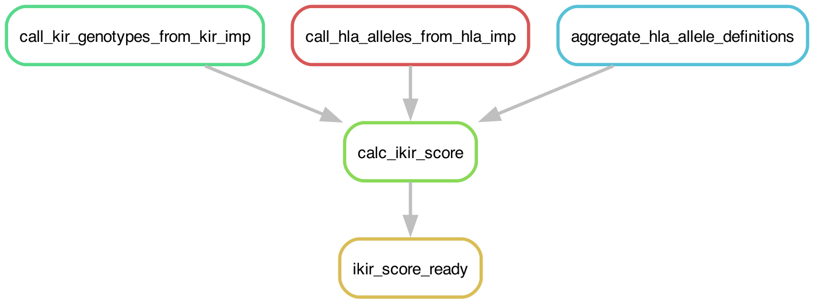

# iKIR_SCORE_CALC
## _A Snakemake Pipeline to Calculate the [Functional iKIR Score](https://doi.org/10.1126/sciimmunol.aao2892) from [KIR*IMP](https://imp.science.unimelb.edu.au/kir/) and [HLA*IMP](https://imp.science.unimelb.edu.au/hla/) imputation results._ 
> The pipeline also supports [T1K (KIR)](https://doi.org/10.1101/gr.277585.122) [Optitype (HLA)](https://doi.org/10.1093/bioinformatics/btu548) variant calling results from scRNA-Seq.

## Authors
* Christopher Michael Brooks ([@chrismbrooks](https://github.com/chrismbrooks))

# Workflow Overview



# Table of Contents
1. [Setup](#setup)
2. [Input](#inputs)
3. [Run](#run)
3. [Output](#output)

# Setup
To download and configure the pipeline, run the following command:

```sh
    git clone https://github.com/ChrisMBrooks/iKIR_SCORE_CALC
    cd iKIR_SCORE_CALC
```

Then, rename ``example.pipeline.config.json`` to ``pipeline.config.json``, vis-a-vis:

```sh
    mv example.pipeline.config.json pipeline.config.json
```

Finally, create a conda environment using the provided ``Envs/snakemake_env.yml`` environment file: 

```sh
conda create -f Envs/snakemake_env.yml
```

# Input (SNP Imputation)
Three main input files must be configured or be made available before the pipeline can be run: 
* ``pipeline.config.json`` configuration files
* ``imputations.csv`` file from KIR*IMP
* ``imputations.csv`` file from HLA*IMP:03

# Alternative Input (scRNA-Seq Typing)

The pipeline also supports iKIR Scoring from scRNA-Seq data via the outputs from the [TENX_2_KIR_HLA](https://github.com/ChrisMBrooks/TENX_2_KIR_HLA) pipeline. The following files are required to run the pipeline in this configuration. 
* ``pipeline.config.json`` configuration files

* ``kir_genotyping_results.csv`` file from T1K. This is a consolidation ``csv`` file of raw T1K results with ``subject_id`` and ``sample_id`` as the primary and secondary keys for each record. Mandatory columns: ``subject_id``, ``sample_id``, ``kir_gene``, ``allele_count``, ``quality_score``. 

* ``hla_geneotyping_results.csv`` file from Optitype HLA. This is a consolidation ``csv`` file of raw Optitype HLA results with ``subject_id`` and ``sample_id`` as the primary and secondary keys for each record. Mandatory columns: ``subject_id``, ``sample_id``, ``hla_gene``, ``hla_allele``. 

> NB ``.parquet`` file format is also supported in place of ``csv``.

## Pipeline Config JSON

The ``pipeline.config.json`` file is a simple high level JSON file containing configuration settings and metadata. The following key-item pairs are required: 

* ``project`` is an input string, and represents the project name to be used by snakemake, e.g. ``KIR_IMP_READY_TEST``. 

*  ``["hla_allele_calling"]["raw_input_filenames"]`` is the filename for the consolidated Optitype HLA results as discussed above. 

*  ``["hla_allele_calling"]["source"]`` is the source type for the above input file, either ``hla_imp`` or ``optitype``.

*  ``["kir_genotype_calling"]["raw_input_filenames"]`` is the filename for the consolidated T1K KIR results as discussed above. 

*  ``["kir_genotype_calling"]["source"]`` is the source type for the above input file, either ``kir_imp`` or ``t1k``.

Configuration parameters for the ``t1k_calling``, ``optitype_calling``, ``kir_imp_calling``, and ``hla_imp_calling`` rules can be adjusted as required using the following parameters: 

* ``quality_threshold`` is a threshold for calling variants. The default value is 0.5, such that a mojority of evidence must favour a particular variant for it to be called (i.e. > 0.5). NB - ``tech_rep_quality_threshold`` is the equivalent for the ``t1k_calling`` rule configuration. 

* ``p_val_quality_threshold`` is the threshold for assessing the reliability of a particular T1K prediction. The default is 0.1 (e.g. quality score of 1 10^-0.1). The original publication suggests this threshold. 

An example JSON is provided below: 

```json
{
    "project":"IKIR_CALC_TEST_PROJECT",
    "hla_allele_calling":{
        "raw_input_filenames":[
            "path/to/hla/imputations.csv"
        ],
        "source":"hla*imp"
    },
    "kir_genotype_calling":{
        "raw_input_filenames":[
            "path/to/kir/imputations.csv"
        ],
        "source":"kir*imp"
    },
    "rule_config":{
        "t1k_calling":{
            "name":"T1K",
            "p_val_quality_threshold":0.1,
            "tech_rep_quality_threshold":0.5
        },
        "optitype_calling":{
            "name":"optitype",
            "quality_threshold":0.5
        },
        "kir_imp_calling":{
            "name":"kir*imp",
            "quality_threshold":0.5

        },
        "hla_imp_calling":{
            "name":"hla*imp",
            "quality_threshold":0.5
        }
    }
}
```

An example of an imputations.csv file from HLA*IMP03:

```csv
ID_1,ID_2,haplotypeID,locus,imputedType,posteriorProbability
subject_xyz,sample_abc,hap.1.1,HLAA,0201,0.99
subject_xyz,sample_abc,hap.1.2,HLAA,1101,1
```

An example of an imputations.csv file from KIR*IMP:

```csv
ID_1,ID_2,haplotypeID,locus,imputedType,posteriorProbability
subject_xyz,sample_abc,hap.472.1,KIR2DL1,1,0.999
subject_xyz,sample_abc,hap.472.2,KIR2DL1,1,0.999
```

An example of a consolidated T1K KIR results file (flattened):

```csv
subject_id,sample_id,kir_gene,allele_count,abundance,quality_score
subject_xyz,sample_abc,KIR2DL1,2,249.030129,60
subject_xyz,sample_abc,KIR2DL2,0,0.0,-1
subject_xyz,sample_abc,KIR2DL3,2,366.609129,60
subject_xyz,sample_abc,KIR2DL4,2,14.783743,6
```

An example of a consolidated Optitype HLA file (flattened):

| subject_id | sample_id | hla_gene | hla_allele | quality_score
| --- | --- | --- | --- | --- 
| subject_xyz | sample_abc | A1 | A*23:01 | 46.0
| subject_xyz | sample_abc | A2 | A*23:01 | 46.0

# Run
To run the pipeline, first activate the snakemake conda environment, ``snakemake_env`` and then run the following command:  

```sh
snakemake --cores 8 --use-conda --conda-frontend conda --keep-going
```

# Output
The results file, ``functional_ikir_scoring.csv``, can be found in the ``outputs/{YOUR_PROJECT}`` directory with the following column headers:

* ``func_ikir_score`` a value from 1 to 4 as float. 
* ``func_ikir_count`` a value from 1 to 4 as float. 
* ``ikir_count`` a value 1 to 4 as float. 
* Functional KIR posession values, e.g.: ``func_kir2dl1``, ``func_kir2dl2``, ``func_kir2dl3``, ``func_kir3dl1`` as booleans.
* HLA ligang posession values, e.g.: ``hla_a_23_bw4``, ``hla_a_24_bw4``, ``hla_a_32_bw4``, ``hla_b_46_c1``, ``hla_b_73_c1``, ``hla_b_bw4``, ``hla_c_c1``, ``hla_c_c2`` as booleans

> NB 1 - The ``func_ikir_score`` is calculated as per [Boelen et al., 2018](https://doi.org/10.1126/sciimmunol.aao2892).

> NB 2 - Ligand motif posession is calculated by first retrieving the relvant HLA protein sequence and signal peptide length from the [IPD](https://www.ebi.ac.uk/ipd/imgt/hla/) and then verifying motif posession using the appropriate defintions as described in ``ref_data/hla_ligand_motif_definitions.json``. 